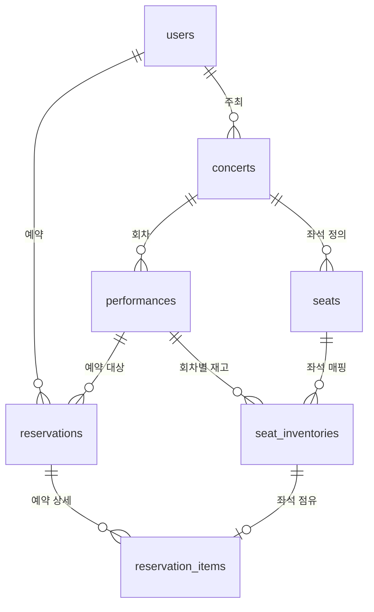

# reservation-demo

공연 예약을 위한 Spring Boot 백엔드 API입니다. 주최사의 공연 등록, 회차별 좌석 재고 관리, 사용자 예약 및 취소 기능을 제공합니다.

## Runtime, Library

- Java 21
- Spring Boot 4
- Spring Data JPA
- Spring Security + JWT
- MySQL 8
- Flyway
- SpringDoc OpenAPI
- Testcontainers

## 패키지 구조

```
com.reservation.demo
├── api/
│   ├── auth/
│   ├── concert/
│   ├── organizer/
│   └── reservation/
├── config/         # 설정
├── domain/         # JPA Entity, Enum
│   ├── concert/
│   ├── reservation/
│   ├── seat/
│   └── user/
├── repository/     # Spring JPA
├── service/        # 비즈니스 로직
└── common/         # 예외 처리, Security 유틸
```

## API

| Method | URL | 권한 | 설명 |
|--------|-----|------|------|
| POST | `/api/v1/auth/signup` | Public | 회원가입 |
| POST | `/api/v1/auth/login` | Public | 로그인 |
| GET | `/api/v1/concerts` | Public | 공연 목록 |
| GET | `/api/v1/concerts/{concertId}` | Public | 공연 상세 |
| GET | `/api/v1/concerts/performances/{performanceId}/seats` | Public | 좌석 맵 |
| POST | `/api/v1/organizer/concerts` | ORGANIZER | 공연 등록 |
| POST | `/api/v1/reservations` | USER | 예약 생성 |
| POST | `/api/v1/reservations/{id}/cancel` | USER | 예약 취소 |
| GET | `/api/v1/reservations/me` | USER | 내 예약 목록 |

## 스키마

테이블명은 DB 그대로이며, 선 위 한글은 관계 설명용입니다 (코드/컬럼명 아님).




## 동시성 설계

### 문제

인기 공연 오픈 시, 여러 사용자가 동일 좌석에 동시 예약하면 중복 예약이 발생할 수 있습니다.

### 현재 해결 전략

1. DB Unique Constraint — `seat_inventories(performance_id, seat_id)` UNIQUE
2. 비관적 락 — `SeatInventoryRepository.findAllByIdInForUpdate()`
3. 좌석 ID 정렬 후 락 — 데드락 방지
4. 단일 트랜잭션 — 좌석 상태 변경 + Reservation / ReservationItem 생성

### 트레이드오프

| 방식 | 장점 | 단점 |
|------|------|------|
| 비관적 락 (현재) | 구현 단순, 정합성 강함 | 동시성 높을 때 DB 부하 (row 경합) |
| 낙관적 락 | 읽기 성능 좋음 | 충돌 시 재시도 로직 필요 |
| Redis 선점 | DB 부하 분산 | 인프라 복잡도 증가, Mysql과 Redis 트랜잭션 처리 불가|
